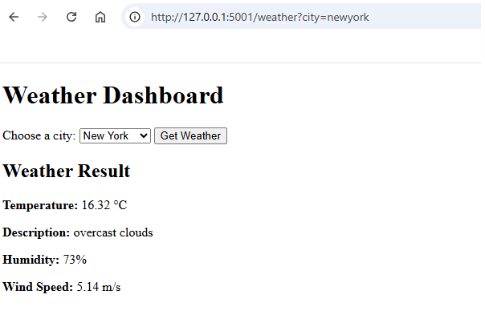

# Weather Frontend

  

This frontend service provides a simple weather dashboard for four locations: New York, Sydney, Cape Town, and Bangkok.

The application displays a dropdown list of cities, sends a request to the backend service, and shows the returned weather result.

## Requirements

- Python 3.11
- Docker
- Running backend service

## Install and Run Locally

Install dependencies and run the application:

    pip install -r requirements.txt
    python app.py

The frontend will run on:

    http://127.0.0.1:5001

## Backend URL Configuration

The frontend calls the backend service using the `BACKEND_URL` environment variable.

Default value in the code:

    http://127.0.0.1:5000

Example for PowerShell:

    $env:BACKEND_URL="http://127.0.0.1:5000"
    python app.py

## Application Flow

1. Select a city from the dropdown list
2. Click the submit button
3. The frontend sends a request to the backend API
4. The weather result is displayed on the page

## Supported Locations

- `newyork`
- `sydney`
- `capetown`
- `bangkok`

## Run with Docker

Build the image:

    docker build -t weather-frontend .

Run the container:

    docker run -p 5001:5001 -e BACKEND_URL=http://host.docker.internal:5000 weather-frontend

## Project Files

- `app.py` - frontend Flask application
- `requirements.txt` - Python dependencies
- `.gitignore` - ignored local files
- `Dockerfile` - container build instructions
- `README.md` - project documentation

## Screenshot

